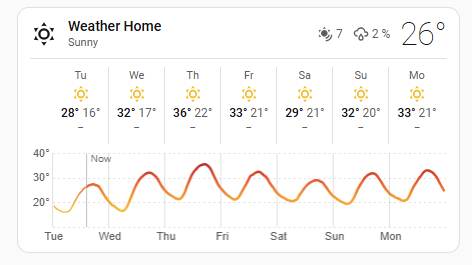
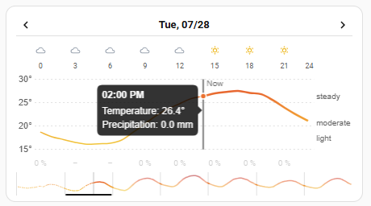

# Beautiful Weather Card

A Home Assistant Lovelace card that renders a **meteogram**: a colour-coded temperature curve layered over stacked precipitation intensity bars. The design is inspired by the charts in the DWD *Warnwetter* app.

Two views share the same hourly forecast:

#### Overview — up to 7 days

Temperature trend and when rain is expected, at a glance.



#### Day — one calendar day, hour by hour

Detailed read-out, up to 7 days into the past — hover any hour for its exact values.



The temperature line is coloured by value — blue below freezing, green around 0 °C, yellow and orange through the mild range, red when it gets hot. Precipitation bars darken as intensity rises, so a heavy hour reads differently from a drizzle even at the same glance.

## Requirements

The weather entity must support **hourly** forecasts (`FORECAST_HOURLY`). Both views are built from that single hourly forecast, so the longer it reaches, the more days the trend view can show.

Developed against [`FL550/dwd_weather`](https://github.com/FL550/dwd_weather), which provides 9 days of hourly data. Any integration exposing hourly forecasts will work; the trend view simply shows fewer days if the forecast is shorter.

## Installation

### HACS (custom repository)

1. HACS → Frontend → ⋮ → *Custom repositories*
2. Add `https://github.com/ldoench/lovelace-beautiful-weather-card` with category *Lovelace*
3. Install **Beautiful Weather Card**, then reload your browser

### Manual

Copy `beautiful-weather-card.js` into `<config>/www/` and register it as a Lovelace resource:

```yaml
url: /local/beautiful-weather-card.js
type: module
```

## Configuration

```yaml
type: custom:beautiful-weather-card
entity: weather.home
```

`entity` is the only required option. Everything else — the full options table,
navigation, the day strip, header extras, feeding in measured values for past
hours, custom colours, and running two cards side by side — is in
[**docs/configuration.md**](docs/configuration.md).

## Credits

This project is not affiliated with or endorsed by the Deutscher Wetterdienst. The chart design is *inspired by* the Warnwetter app.

Built with [Chart.js](https://www.chartjs.org/) and [Lit](https://lit.dev/).

MIT licensed.
